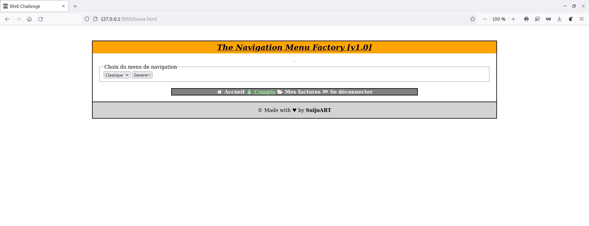
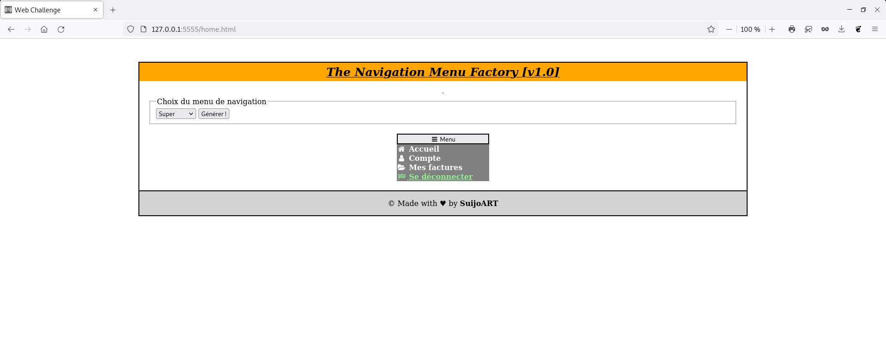

# Challenge 1 : WEB #

## Contexte ##

Ce challenge est issue du discord de l'influenceur tech Frère codeur.
Afin de maintenir une veille technique, progresser et s'amuser, le modérateur SuijoART propose un challenge par semaine et le premier concerne l'intégration web.

Le but est de réaliser sans contrainte de temps une intégration html/css/js correspondant au visuel proposé.

## Détail ##

Réaliser le site web ci-dessous en utilisant uniquement HTML, CSS & JavaScript.
L'utilisation de framework web et d'outils no code n'est pas autorisé pour ce défi.



Indications HTML :

🔴 Ajouter la balise suivante dans la balise ``` <head>``` de votre code afin de pouvoir afficher les icônes de votre menu :

```html
<link rel="stylesheet" href="https://cdnjs.cloudflare.com/ajax/libs/font-awesome/4.7.0/css/font-awesome.min.css" />
```

🔴 Balises des icônes :

```html
<i class="fa fa-fw fa-home"></i>
<i class="fa fa-fw fa-user"></i>
<i class="fa fa-fw fa-folder-open"></i>
<i class="fa fa-fw fa-flag-checkered"></i>
```

Indication CSS:

🔴  Ci-dessous le code CSS minimal de page web (le reste est à compléter) :

```css
body {
margin: 50px 300px 200px 300px;
display: flex;
flex-direction: column;
border: 2px solid black;
}
h1 {
margin-top: 0px;
padding: 5px;
font-size: 25px;
font-style: italic;
text-align: center;
text-decoration: underline;
background-color: orange;
}
```
